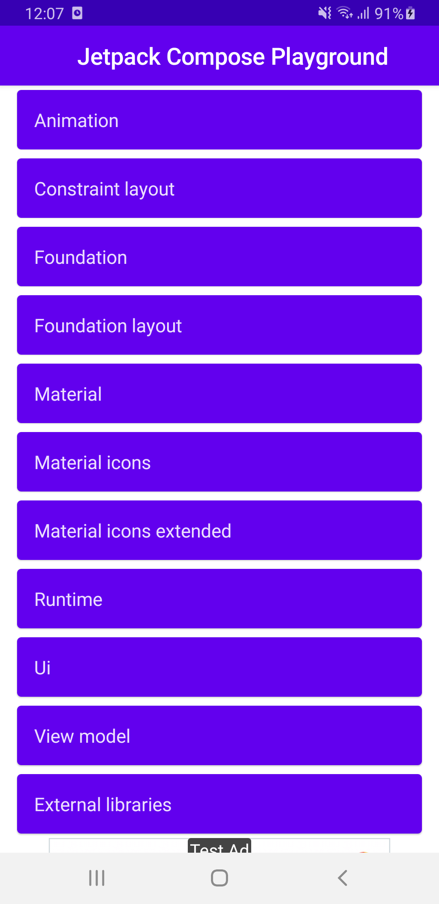
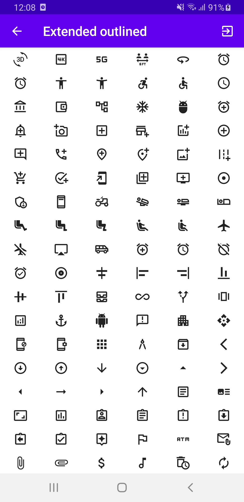
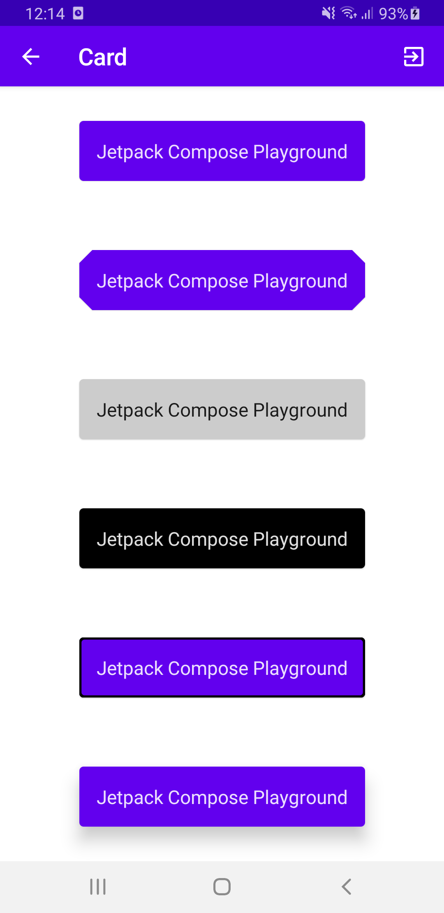
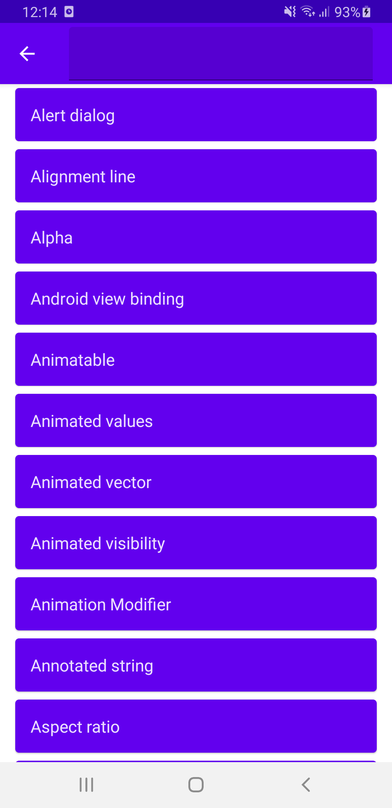

# Jetpack Compose Playground

## Introduction

Jetpack Compose Playground is a small showcase application and repository of what Jetpack Compose has to offer and how it improves everyday Android UI development.
Based on [official link](https://developer.android.com/jetpack/compose) and the [docs](https://developer.android.com/jetpack/compose/documentation), the application has screens with examples for most components and cases.
This application supposed to be used be developers in order to see hands on the examples for jetpack compose.
Each screen has a button link directing the user to the github file containing the code.
Some code examples are from [androidx compose samples](https://github.com/androidx/androidx/tree/androidx-main/compose), [accompanist](https://github.com/google/accompanist).

Please provide any feedback via github issues or via email on : steleor@gmail.com

## Screens

