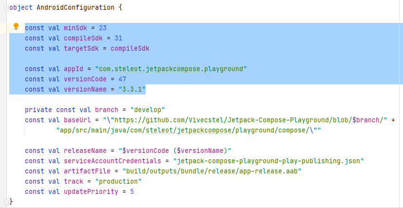
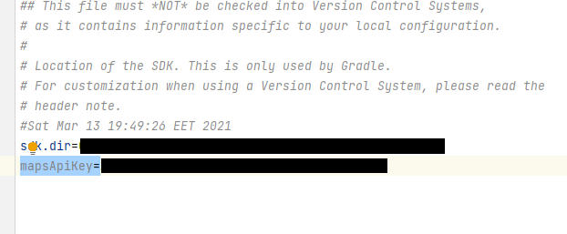

# Jetpack Compose Playground

Offering **more than 305 screens** with examples of **Jetpack Compose**.

## Introduction

**Jetpack Compose Playground** is a showcase application and repository showing what Jetpack Compose
has to offer and how it improves everyday Android UI development. It offers more 305 screens with
examples. Based on [official link](https://developer.android.com/jetpack/compose) and
the [docs](https://developer.android.com/jetpack/compose/documentation), the application has screens
with examples for most components and cases. This application is supposed to be used by developers
in order to see hands on the examples for jetpack compose. Each screen has a button link directing
the user to the Github file containing the code. Some code examples are
from [androidx compose samples](https://github.com/androidx/androidx/tree/androidx-main/compose)
and [accompanist](https://github.com/google/accompanist).

Please provide any feedback via github issues or via email on : **steleotr@gmail.com**

The application will be updated as soon as possible when a new release of compose is available.

Download from:

### Featured in :star:

### Spread Some :heart:

  

 

## Available Screens

 - [Activity](documentation/activity.md) (3 screens)
 - [Animation](documentation/animation.md) (17 screens)
 - [Constraint Layout](documentation/constraintLayout.md) (11 screens)
 - [Custom Examples](documentation/customExamples.md) (17 screens)
 - [External Libraries](documentation/externalLibraries.md) (40 screens)
 - [Foundation](documentation/foundation.md) (44 screens)
 - [Material](documentation/material.md) (49 screens)
 - [Material 3 - Material you](documentation/material3.md) (38 screens)
 - [Material Icons](documentation/materialIcons.md) (5 screens)
 - [Material Icons Extended](documentation/materialIconsExtended.md) (5 screens)
 - [Navigation](app/src/main/java/com/steleot/jetpackcompose/playground/compose/navigation/NavigationScreen.kt) (1 screen)
 - [Paging](app/src/main/java/com/steleot/jetpackcompose/playground/compose/paging/PagingScreen.kt) (1 screen)
 - [Runtime](documentation/runtime.md) (18 screens)
 - [Ui](documentation/ui.md) (56 screens)
 - [ViewModel](documentation/viewModel.md) (3 screens)

## Instructions

In order to run the project:

* Use latest Android Studio.

* Change appId constant in AndroidConfiguration.kt to your applicationId.

* Create a firebase android project with the applicationId you provided and download and add
google-services.json to the project under app/src folder.

* Add a google maps key in local properties file (valid one in order to see google maps example).

## Screenshots

 - [Mobile Screenshots](documentation/mobileScreenshots.md)
 - [Tablet 7-inch Screenshots](documentation/tablet7inchScreenshots.md)
 - [Tablet 10-inch Screenshots](documentation/tablet10inchScreenshots.md)
