# Jetpack Compose Playground

Offering **more than 230 screens** with examples of **Jetpack Compose**.

## Introduction

**Jetpack Compose Playground** is a showcase application and repository showing what Jetpack Compose
has to offer and how it improves everyday Android UI development. It offers more 230 screens with
examples. Based on [official link](https://developer.android.com/jetpack/compose) and
the [docs](https://developer.android.com/jetpack/compose/documentation), the application has screens
with examples for most components and cases. This application is supposed to be used by developers
in order to see hands on the examples for jetpack compose. Each screen has a button link directing
the user to the Github file containing the code. Some code examples are
from [androidx compose samples](https://github.com/androidx/androidx/tree/androidx-main/compose)
and [accompanist](https://github.com/google/accompanist).

Please provide any feedback via github issues or via email on : **steleotr@gmail.com**

The application will be updated as soon as possible when a new release of compose is available.

Download from:

### Featured in :star:

### Spread Some :heart:

  

 

## Available Screens

 - Activity
   - [BackHandler](https://github.com/Vivecstel/Jetpack-Compose-Playground/blob/master/app/src/main/java/com/steleot/jetpackcompose/playground/compose/activity/BackHandlerScreen.kt)
   - [LauncherForActivityResult1](https://github.com/Vivecstel/Jetpack-Compose-Playground/blob/master/app/src/main/java/com/steleot/jetpackcompose/playground/compose/activity/LauncherForActivityResult1Screen.kt)
   - [LauncherForActivityResult2](https://github.com/Vivecstel/Jetpack-Compose-Playground/blob/master/app/src/main/java/com/steleot/jetpackcompose/playground/compose/activity/LauncherForActivityResult2Screen.kt)
 - Animation
   - [Animatable](https://github.com/Vivecstel/Jetpack-Compose-Playground/blob/master/app/src/main/java/com/steleot/jetpackcompose/playground/compose/animation/AnimatableScreen.kt)
   - [AnimatedContent](https://github.com/Vivecstel/Jetpack-Compose-Playground/blob/master/app/src/main/java/com/steleot/jetpackcompose/playground/compose/animation/AnimatedContentScreen.kt)
   - [AnimatedValues](https://github.com/Vivecstel/Jetpack-Compose-Playground/blob/master/app/src/main/java/com/steleot/jetpackcompose/playground/compose/animation/AnimatedValuesScreen.kt)
   - [AnimatedVector](https://github.com/Vivecstel/Jetpack-Compose-Playground/blob/master/app/src/main/java/com/steleot/jetpackcompose/playground/compose/animation/AnimatedVectorScreen.kt)
   - [AnimatedVisibility](https://github.com/Vivecstel/Jetpack-Compose-Playground/blob/master/app/src/main/java/com/steleot/jetpackcompose/playground/compose/animation/AnimatedVisibilityScreen.kt)
   - [AnimateEnterExit](https://github.com/Vivecstel/Jetpack-Compose-Playground/blob/master/app/src/main/java/com/steleot/jetpackcompose/playground/compose/animation/AnimateEnterExitScreen.kt)
   - [AnimationModifier](https://github.com/Vivecstel/Jetpack-Compose-Playground/blob/master/app/src/main/java/com/steleot/jetpackcompose/playground/compose/animation/AnimationModifierScreen.kt)
   - [CrossfadeAnimation](https://github.com/Vivecstel/Jetpack-Compose-Playground/blob/master/app/src/main/java/com/steleot/jetpackcompose/playground/compose/animation/CrossfadeAnimationScreen.kt)
   - [DoubleTapToLike](https://github.com/Vivecstel/Jetpack-Compose-Playground/blob/master/app/src/main/java/com/steleot/jetpackcompose/playground/compose/animation/DoubleTapToLikeScreen.kt)
   - [GestureAnimation](https://github.com/Vivecstel/Jetpack-Compose-Playground/blob/master/app/src/main/java/com/steleot/jetpackcompose/playground/compose/animation/GestureAnimationScreen.kt)
   - [InfiniteTransition](https://github.com/Vivecstel/Jetpack-Compose-Playground/blob/master/app/src/main/java/com/steleot/jetpackcompose/playground/compose/animation/InfiniteTransitionScreen.kt)
   - [RotatingShape](https://github.com/Vivecstel/Jetpack-Compose-Playground/blob/master/app/src/main/java/com/steleot/jetpackcompose/playground/compose/animation/RotatingShapeScreen.kt)
   - [SingleValueColorAnimation](https://github.com/Vivecstel/Jetpack-Compose-Playground/blob/master/app/src/main/java/com/steleot/jetpackcompose/playground/compose/animation/SingleValueColorAnimationScreen.kt)
   - [SingleValueFloatAnimation](https://github.com/Vivecstel/Jetpack-Compose-Playground/blob/master/app/src/main/java/com/steleot/jetpackcompose/playground/compose/animation/SingleValueFloatAnimationScreen.kt)
   - [SuspendAnimation](https://github.com/Vivecstel/Jetpack-Compose-Playground/blob/master/app/src/main/java/com/steleot/jetpackcompose/playground/compose/animation/SuspendAnimationScreen.kt)
 - ConstraintLayout
   - [Barrier](https://github.com/Vivecstel/Jetpack-Compose-Playground/blob/master/app/src/main/java/com/steleot/jetpackcompose/playground/compose/constraintlayout/BarrierScreen.kt)
   - [Chain](https://github.com/Vivecstel/Jetpack-Compose-Playground/blob/master/app/src/main/java/com/steleot/jetpackcompose/playground/compose/constraintlayout/ChainScreen.kt)
   - [Circular](https://github.com/Vivecstel/Jetpack-Compose-Playground/blob/master/app/src/main/java/com/steleot/jetpackcompose/playground/compose/constraintlayout/CircularScreen.kt)
   - [ConstraintSet](https://github.com/Vivecstel/Jetpack-Compose-Playground/blob/master/app/src/main/java/com/steleot/jetpackcompose/playground/compose/constraintlayout/ConstraintSetScreen.kt)
   - [CreateGuideline](https://github.com/Vivecstel/Jetpack-Compose-Playground/blob/master/app/src/main/java/com/steleot/jetpackcompose/playground/compose/constraintlayout/CreateGuidelineScreen.kt)
   - [CreateRefs](https://github.com/Vivecstel/Jetpack-Compose-Playground/blob/master/app/src/main/java/com/steleot/jetpackcompose/playground/compose/constraintlayout/CreateRefsScreen.kt)
   - [JsonConstraintSet](https://github.com/Vivecstel/Jetpack-Compose-Playground/blob/master/app/src/main/java/com/steleot/jetpackcompose/playground/compose/constraintlayout/JsonConstraintSetScreen.kt)
   - [JsonConstraintSetWithVariables](https://github.com/Vivecstel/Jetpack-Compose-Playground/blob/master/app/src/main/java/com/steleot/jetpackcompose/playground/compose/constraintlayout/JsonConstraintSetWithVariablesScreen.kt)
   - [MotionLayout1](https://github.com/Vivecstel/Jetpack-Compose-Playground/blob/master/app/src/main/java/com/steleot/jetpackcompose/playground/compose/constraintlayout/MotionLayout1Screen.kt)
   - [MotionLayout2](https://github.com/Vivecstel/Jetpack-Compose-Playground/blob/master/app/src/main/java/com/steleot/jetpackcompose/playground/compose/constraintlayout/MotionLayout2Screen.kt)
   - [MotionLayout3](https://github.com/Vivecstel/Jetpack-Compose-Playground/blob/master/app/src/main/java/com/steleot/jetpackcompose/playground/compose/constraintlayout/MotionLayout3Screen.kt)
 - CustomExamples
   - [AdMobBanner](https://github.com/Vivecstel/Jetpack-Compose-Playground/blob/master/app/src/main/java/com/steleot/jetpackcompose/playground/compose/customexamples/AdMobBannerScreen.kt)
   - [AnimatedDeleteList](https://github.com/Vivecstel/Jetpack-Compose-Playground/blob/master/app/src/main/java/com/steleot/jetpackcompose/playground/compose/customexamples/AnimatedDeleteListScreen.kt)
   - [AnimatedExtendedFloatingActionButton](https://github.com/Vivecstel/Jetpack-Compose-Playground/blob/master/app/src/main/java/com/steleot/jetpackcompose/playground/compose/customexamples/AnimatedExtendedFloatingActionButtonScreen.kt)
   - [AnimatedShowList](https://github.com/Vivecstel/Jetpack-Compose-Playground/blob/master/app/src/main/java/com/steleot/jetpackcompose/playground/compose/customexamples/AnimatedShowListScreen.kt)
   - [AnimatedText](https://github.com/Vivecstel/Jetpack-Compose-Playground/blob/master/app/src/main/java/com/steleot/jetpackcompose/playground/compose/customexamples/AnimatedTextScreen.kt)
   - [BarChart](https://github.com/Vivecstel/Jetpack-Compose-Playground/blob/master/app/src/main/java/com/steleot/jetpackcompose/playground/compose/customexamples/BarChartScreen.kt)
   - [CameraX](https://github.com/Vivecstel/Jetpack-Compose-Playground/blob/master/app/src/main/java/com/steleot/jetpackcompose/playground/compose/customexamples/CameraXScreen.kt)
   - [CollapsingToolbar](https://github.com/Vivecstel/Jetpack-Compose-Playground/blob/master/app/src/main/java/com/steleot/jetpackcompose/playground/compose/customexamples/CollapsingToolbarScreen.kt)
   - [ColorMatrix](https://github.com/Vivecstel/Jetpack-Compose-Playground/blob/master/app/src/main/java/com/steleot/jetpackcompose/playground/compose/customexamples/ColorMatrixScreen.kt)
   - [CurvedScrollView](https://github.com/Vivecstel/Jetpack-Compose-Playground/blob/master/app/src/main/java/com/steleot/jetpackcompose/playground/compose/customexamples/CurvedScrollViewScreen.kt)
   - [CurvedText](https://github.com/Vivecstel/Jetpack-Compose-Playground/blob/master/app/src/main/java/com/steleot/jetpackcompose/playground/compose/customexamples/CurvedTextScreen.kt)
   - [FirstBaselineToTop](https://github.com/Vivecstel/Jetpack-Compose-Playground/blob/master/app/src/main/java/com/steleot/jetpackcompose/playground/compose/customexamples/FirstBaselineToTopScreen.kt)
   - [MessageBubble](https://github.com/Vivecstel/Jetpack-Compose-Playground/blob/master/app/src/main/java/com/steleot/jetpackcompose/playground/compose/customexamples/MessageBubbleScreen.kt)
   - [StaggeredGridList](https://github.com/Vivecstel/Jetpack-Compose-Playground/blob/master/app/src/main/java/com/steleot/jetpackcompose/playground/compose/customexamples/StaggeredGridListScreen.kt)
   - [StyledText](https://github.com/Vivecstel/Jetpack-Compose-Playground/blob/master/app/src/main/java/com/steleot/jetpackcompose/playground/compose/customexamples/StyledTextScreen.kt)
   - [TearDrop](https://github.com/Vivecstel/Jetpack-Compose-Playground/blob/master/app/src/main/java/com/steleot/jetpackcompose/playground/compose/customexamples/TearDropScreen.kt)
 - ExternalLibraries
   - [CoilLandscapist](https://github.com/Vivecstel/Jetpack-Compose-Playground/blob/master/app/src/main/java/com/steleot/jetpackcompose/playground/compose/externallibraries/CoilLandscapistScreen.kt)
   - [Coil](https://github.com/Vivecstel/Jetpack-Compose-Playground/blob/master/app/src/main/java/com/steleot/jetpackcompose/playground/compose/externallibraries/CoilScreen.kt)
   - [ComposeCharts](https://github.com/Vivecstel/Jetpack-Compose-Playground/blob/master/app/src/main/java/com/steleot/jetpackcompose/playground/compose/externallibraries/ComposeChartsScreen.kt)
   - [ComposeMarkdown](https://github.com/Vivecstel/Jetpack-Compose-Playground/blob/master/app/src/main/java/com/steleot/jetpackcompose/playground/compose/externallibraries/ComposeMarkdownScreen.kt)
   - [ComposeRichTextPrinting](https://github.com/Vivecstel/Jetpack-Compose-Playground/blob/master/app/src/main/java/com/steleot/jetpackcompose/playground/compose/externallibraries/ComposeRichTextPrintingScreen.kt)
   - [ComposeRichTextSlideshow](https://github.com/Vivecstel/Jetpack-Compose-Playground/blob/master/app/src/main/java/com/steleot/jetpackcompose/playground/compose/externallibraries/ComposeRichTextSlideshowScreen.kt)
   - [ComposeRichTextUiMaterial](https://github.com/Vivecstel/Jetpack-Compose-Playground/blob/master/app/src/main/java/com/steleot/jetpackcompose/playground/compose/externallibraries/ComposeRichTextUiMaterialScreen.kt)
   - [ComposeRichTextUi](https://github.com/Vivecstel/Jetpack-Compose-Playground/blob/master/app/src/main/java/com/steleot/jetpackcompose/playground/compose/externallibraries/ComposeRichTextUiScreen.kt)
   - [DrawablePainterAccompanist](https://github.com/Vivecstel/Jetpack-Compose-Playground/blob/master/app/src/main/java/com/steleot/jetpackcompose/playground/compose/externallibraries/DrawablePainterAccompanistScreen.kt)
   - [FlowLayoutAccompanist](https://github.com/Vivecstel/Jetpack-Compose-Playground/blob/master/app/src/main/java/com/steleot/jetpackcompose/playground/compose/externallibraries/FlowLayoutAccompanistScreen.kt)
   - [FontAwesome](https://github.com/Vivecstel/Jetpack-Compose-Playground/blob/master/app/src/main/java/com/steleot/jetpackcompose/playground/compose/externallibraries/FontAwesomeScreen.kt)
   - [FrescoLandscapist](https://github.com/Vivecstel/Jetpack-Compose-Playground/blob/master/app/src/main/java/com/steleot/jetpackcompose/playground/compose/externallibraries/FrescoLandscapistScreen.kt)
   - [GlideLandscapist](https://github.com/Vivecstel/Jetpack-Compose-Playground/blob/master/app/src/main/java/com/steleot/jetpackcompose/playground/compose/externallibraries/GlideLandscapistScreen.kt)
   - [InsetsAccompanist](https://github.com/Vivecstel/Jetpack-Compose-Playground/blob/master/app/src/main/java/com/steleot/jetpackcompose/playground/compose/externallibraries/InsetsAccompanistScreen.kt)
   - [Lottie](https://github.com/Vivecstel/Jetpack-Compose-Playground/blob/master/app/src/main/java/com/steleot/jetpackcompose/playground/compose/externallibraries/LottieScreen.kt)
   - [NavigationAnimationAccompanist](https://github.com/Vivecstel/Jetpack-Compose-Playground/blob/master/app/src/main/java/com/steleot/jetpackcompose/playground/compose/externallibraries/NavigationAnimationAccompanistScreen.kt)
   - [NavigationMaterialAccompanist](https://github.com/Vivecstel/Jetpack-Compose-Playground/blob/master/app/src/main/java/com/steleot/jetpackcompose/playground/compose/externallibraries/NavigationMaterialAccompanistScreen.kt)
   - [OrchestraBalloon](https://github.com/Vivecstel/Jetpack-Compose-Playground/blob/master/app/src/main/java/com/steleot/jetpackcompose/playground/compose/externallibraries/OrchestraBalloonScreen.kt)
   - [OrchestraColorPicker](https://github.com/Vivecstel/Jetpack-Compose-Playground/blob/master/app/src/main/java/com/steleot/jetpackcompose/playground/compose/externallibraries/OrchestraColorPickerScreen.kt)
   - [PagerAccompanist](https://github.com/Vivecstel/Jetpack-Compose-Playground/blob/master/app/src/main/java/com/steleot/jetpackcompose/playground/compose/externallibraries/PagerAccompanistScreen.kt)
   - [PermissionsAccompanist](https://github.com/Vivecstel/Jetpack-Compose-Playground/blob/master/app/src/main/java/com/steleot/jetpackcompose/playground/compose/externallibraries/PermissionsAccompanistScreen.kt)
   - [PlaceholderAccompanist](https://github.com/Vivecstel/Jetpack-Compose-Playground/blob/master/app/src/main/java/com/steleot/jetpackcompose/playground/compose/externallibraries/PlaceholderAccompanistScreen.kt)
   - [RatingBar](https://github.com/Vivecstel/Jetpack-Compose-Playground/blob/master/app/src/main/java/com/steleot/jetpackcompose/playground/compose/externallibraries/RatingBarScreen.kt)
   - [RevealSwipe](https://github.com/Vivecstel/Jetpack-Compose-Playground/blob/master/app/src/main/java/com/steleot/jetpackcompose/playground/compose/externallibraries/RevealSwipeScreen.kt)
   - [SpeedDialFloatingActionButton](https://github.com/Vivecstel/Jetpack-Compose-Playground/blob/master/app/src/main/java/com/steleot/jetpackcompose/playground/compose/externallibraries/SpeedDialFloatingActionButtonScreen.kt)
   - [SwipeRefreshAccompanist](https://github.com/Vivecstel/Jetpack-Compose-Playground/blob/master/app/src/main/java/com/steleot/jetpackcompose/playground/compose/externallibraries/SwipeRefreshAccompanistScreen.kt)
   - [SystemUiControllerAccompanist](https://github.com/Vivecstel/Jetpack-Compose-Playground/blob/master/app/src/main/java/com/steleot/jetpackcompose/playground/compose/externallibraries/SystemUiControllerAccompanistScreen.kt)
 - Foundation
   - [Background](https://github.com/Vivecstel/Jetpack-Compose-Playground/blob/master/app/src/main/java/com/steleot/jetpackcompose/playground/compose/foundation/BackgroundScreen.kt)
   - [Border](https://github.com/Vivecstel/Jetpack-Compose-Playground/blob/master/app/src/main/java/com/steleot/jetpackcompose/playground/compose/foundation/BorderScreen.kt)
   - [Canvas](https://github.com/Vivecstel/Jetpack-Compose-Playground/blob/master/app/src/main/java/com/steleot/jetpackcompose/playground/compose/foundation/CanvasScreen.kt)
   - [Clickable](https://github.com/Vivecstel/Jetpack-Compose-Playground/blob/master/app/src/main/java/com/steleot/jetpackcompose/playground/compose/foundation/ClickableScreen.kt)
   - [ClickableText](https://github.com/Vivecstel/Jetpack-Compose-Playground/blob/master/app/src/main/java/com/steleot/jetpackcompose/playground/compose/foundation/ClickableTextScreen.kt)
   - [CombinedClickable](https://github.com/Vivecstel/Jetpack-Compose-Playground/blob/master/app/src/main/java/com/steleot/jetpackcompose/playground/compose/foundation/CombinedClickableScreen.kt)
   - [DragGestureDetector](https://github.com/Vivecstel/Jetpack-Compose-Playground/blob/master/app/src/main/java/com/steleot/jetpackcompose/playground/compose/foundation/DragGestureDetectorScreen.kt)
   - [Draggable](https://github.com/Vivecstel/Jetpack-Compose-Playground/blob/master/app/src/main/java/com/steleot/jetpackcompose/playground/compose/foundation/DraggableScreen.kt)
   - [Focusable](https://github.com/Vivecstel/Jetpack-Compose-Playground/blob/master/app/src/main/java/com/steleot/jetpackcompose/playground/compose/foundation/FocusableScreen.kt)
   - [Image](https://github.com/Vivecstel/Jetpack-Compose-Playground/blob/master/app/src/main/java/com/steleot/jetpackcompose/playground/compose/foundation/ImageScreen.kt)
   - [InteractionSource](https://github.com/Vivecstel/Jetpack-Compose-Playground/blob/master/app/src/main/java/com/steleot/jetpackcompose/playground/compose/foundation/InteractionSourceScreen.kt)
   - [LazyColumn](https://github.com/Vivecstel/Jetpack-Compose-Playground/blob/master/app/src/main/java/com/steleot/jetpackcompose/playground/compose/foundation/LazyColumnScreen.kt)
   - [LazyGrid](https://github.com/Vivecstel/Jetpack-Compose-Playground/blob/master/app/src/main/java/com/steleot/jetpackcompose/playground/compose/foundation/LazyGridScreen.kt)
   - [LazyRow](https://github.com/Vivecstel/Jetpack-Compose-Playground/blob/master/app/src/main/java/com/steleot/jetpackcompose/playground/compose/foundation/LazyRowScreen.kt)
   - [Scrollable](https://github.com/Vivecstel/Jetpack-Compose-Playground/blob/master/app/src/main/java/com/steleot/jetpackcompose/playground/compose/foundation/ScrollableScreen.kt)
   - [Scroller](https://github.com/Vivecstel/Jetpack-Compose-Playground/blob/master/app/src/main/java/com/steleot/jetpackcompose/playground/compose/foundation/ScrollerScreen.kt)
   - [SelectableGroup](https://github.com/Vivecstel/Jetpack-Compose-Playground/blob/master/app/src/main/java/com/steleot/jetpackcompose/playground/compose/foundation/SelectableGroupScreen.kt)
   - [Selectable](https://github.com/Vivecstel/Jetpack-Compose-Playground/blob/master/app/src/main/java/com/steleot/jetpackcompose/playground/compose/foundation/SelectableScreen.kt)
   - [SelectionContainer](https://github.com/Vivecstel/Jetpack-Compose-Playground/blob/master/app/src/main/java/com/steleot/jetpackcompose/playground/compose/foundation/SelectionContainerScreen.kt)
   - [Shape](https://github.com/Vivecstel/Jetpack-Compose-Playground/blob/master/app/src/main/java/com/steleot/jetpackcompose/playground/compose/foundation/ShapeScreen.kt)
   - [StickyHeader](https://github.com/Vivecstel/Jetpack-Compose-Playground/blob/master/app/src/main/java/com/steleot/jetpackcompose/playground/compose/foundation/StickyHeaderScreen.kt)
   - [Toggeable](https://github.com/Vivecstel/Jetpack-Compose-Playground/blob/master/app/src/main/java/com/steleot/jetpackcompose/playground/compose/foundation/ToggeableScreen.kt)
   - [TransformGesture](https://github.com/Vivecstel/Jetpack-Compose-Playground/blob/master/app/src/main/java/com/steleot/jetpackcompose/playground/compose/foundation/TransformGestureScreen.kt)
   - [Transformable](https://github.com/Vivecstel/Jetpack-Compose-Playground/blob/master/app/src/main/java/com/steleot/jetpackcompose/playground/compose/foundation/TransformableScreen.kt)
 - FoundationLayout
   - [AspectRatio](https://github.com/Vivecstel/Jetpack-Compose-Playground/blob/master/app/src/main/java/com/steleot/jetpackcompose/playground/compose/foundationlayout/AspectRationScreen.kt)
   - [Box](https://github.com/Vivecstel/Jetpack-Compose-Playground/blob/master/app/src/main/java/com/steleot/jetpackcompose/playground/compose/foundationlayout/BoxScreen.kt)
   - [BoxWithConstraints](https://github.com/Vivecstel/Jetpack-Compose-Playground/blob/master/app/src/main/java/com/steleot/jetpackcompose/playground/compose/foundationlayout/BoxWithConstraintsScreen.kt)
   - [Column](https://github.com/Vivecstel/Jetpack-Compose-Playground/blob/master/app/src/main/java/com/steleot/jetpackcompose/playground/compose/foundationlayout/ColumnScreen.kt)
   - [DefaultMinSize](https://github.com/Vivecstel/Jetpack-Compose-Playground/blob/master/app/src/main/java/com/steleot/jetpackcompose/playground/compose/foundationlayout/DefaultMinSizeScreen.kt)
   - [Intrinsic](https://github.com/Vivecstel/Jetpack-Compose-Playground/blob/master/app/src/main/java/com/steleot/jetpackcompose/playground/compose/foundationlayout/IntrinsicScreen.kt)
   - [Offset](https://github.com/Vivecstel/Jetpack-Compose-Playground/blob/master/app/src/main/java/com/steleot/jetpackcompose/playground/compose/foundationlayout/OffsetScreen.kt)
   - [Padding](https://github.com/Vivecstel/Jetpack-Compose-Playground/blob/master/app/src/main/java/com/steleot/jetpackcompose/playground/compose/foundationlayout/PaddingScreen.kt)
   - [Row](https://github.com/Vivecstel/Jetpack-Compose-Playground/blob/master/app/src/main/java/com/steleot/jetpackcompose/playground/compose/foundationlayout/RowScreen.kt)
   - [Size](https://github.com/Vivecstel/Jetpack-Compose-Playground/blob/master/app/src/main/java/com/steleot/jetpackcompose/playground/compose/foundationlayout/SizeScreen.kt)
   - [Spacer](https://github.com/Vivecstel/Jetpack-Compose-Playground/blob/master/app/src/main/java/com/steleot/jetpackcompose/playground/compose/foundationlayout/SpacerScreen.kt)
 - Material
   - [AlertDialog](https://github.com/Vivecstel/Jetpack-Compose-Playground/blob/master/app/src/main/java/com/steleot/jetpackcompose/playground/compose/material/AlertDialogScreen.kt)
   - [BackdropScaffold](https://github.com/Vivecstel/Jetpack-Compose-Playground/blob/master/app/src/main/java/com/steleot/jetpackcompose/playground/compose/material/BackdropScaffoldScreen.kt)
   - [BadgedBox](https://github.com/Vivecstel/Jetpack-Compose-Playground/blob/master/app/src/main/java/com/steleot/jetpackcompose/playground/compose/material/BadgedBoxScreen.kt)
   - [BottomAppBar](https://github.com/Vivecstel/Jetpack-Compose-Playground/blob/master/app/src/main/java/com/steleot/jetpackcompose/playground/compose/material/BottomAppBarScreen.kt)
   - [BottomDrawer](https://github.com/Vivecstel/Jetpack-Compose-Playground/blob/master/app/src/main/java/com/steleot/jetpackcompose/playground/compose/material/BottomDrawerScreen.kt)
   - [BottomNavigation](https://github.com/Vivecstel/Jetpack-Compose-Playground/blob/master/app/src/main/java/com/steleot/jetpackcompose/playground/compose/material/BottomNavigationScreen.kt)
   - [BottomSheetScaffold](https://github.com/Vivecstel/Jetpack-Compose-Playground/blob/master/app/src/main/java/com/steleot/jetpackcompose/playground/compose/material/BottomSheetScaffoldScreen.kt)
   - [Button](https://github.com/Vivecstel/Jetpack-Compose-Playground/blob/master/app/src/main/java/com/steleot/jetpackcompose/playground/compose/material/ButtonScreen.kt)
   - [Card](https://github.com/Vivecstel/Jetpack-Compose-Playground/blob/master/app/src/main/java/com/steleot/jetpackcompose/playground/compose/material/CardScreen.kt)
   - [Checkbox](https://github.com/Vivecstel/Jetpack-Compose-Playground/blob/master/app/src/main/java/com/steleot/jetpackcompose/playground/compose/material/CheckboxScreen.kt)
   - [Divider](https://github.com/Vivecstel/Jetpack-Compose-Playground/blob/master/app/src/main/java/com/steleot/jetpackcompose/playground/compose/material/DividerScreen.kt)
   - [DropdownMenu](https://github.com/Vivecstel/Jetpack-Compose-Playground/blob/master/app/src/main/java/com/steleot/jetpackcompose/playground/compose/material/DropdownMenuScreen.kt)
   - [Elevation](https://github.com/Vivecstel/Jetpack-Compose-Playground/blob/master/app/src/main/java/com/steleot/jetpackcompose/playground/compose/material/ElevationScreen.kt)
   - [FloatingActionButton](https://github.com/Vivecstel/Jetpack-Compose-Playground/blob/master/app/src/main/java/com/steleot/jetpackcompose/playground/compose/material/FloatingActionButtonScreen.kt)
   - [ExtendedFloatingActionButton](https://github.com/Vivecstel/Jetpack-Compose-Playground/blob/master/app/src/main/java/com/steleot/jetpackcompose/playground/compose/material/ExtendedFloatingActionButtonScreen.kt)
   - [IconButton](https://github.com/Vivecstel/Jetpack-Compose-Playground/blob/master/app/src/main/java/com/steleot/jetpackcompose/playground/compose/material/IconButtonScreen.kt)
   - [Icon](https://github.com/Vivecstel/Jetpack-Compose-Playground/blob/master/app/src/main/java/com/steleot/jetpackcompose/playground/compose/material/IconScreen.kt)
   - [IconToggleButton](https://github.com/Vivecstel/Jetpack-Compose-Playground/blob/master/app/src/main/java/com/steleot/jetpackcompose/playground/compose/material/IconToggleButtonScreen.kt)
   - [ListItem](https://github.com/Vivecstel/Jetpack-Compose-Playground/blob/master/app/src/main/java/com/steleot/jetpackcompose/playground/compose/material/ListItemScreen.kt)
   - [LocalContentAlpha](https://github.com/Vivecstel/Jetpack-Compose-Playground/blob/master/app/src/main/java/com/steleot/jetpackcompose/playground/compose/material/LocalContentAlphaScreen.kt)
   - [LocalContentColor](https://github.com/Vivecstel/Jetpack-Compose-Playground/blob/master/app/src/main/java/com/steleot/jetpackcompose/playground/compose/material/LocalContentColorScreen.kt)
   - [MaterialTheme](https://github.com/Vivecstel/Jetpack-Compose-Playground/blob/master/app/src/main/java/com/steleot/jetpackcompose/playground/compose/material/MaterialThemeScreen.kt)
   - [ModalBottomSheetLayout](https://github.com/Vivecstel/Jetpack-Compose-Playground/blob/master/app/src/main/java/com/steleot/jetpackcompose/playground/compose/material/ModalBottomSheetLayoutScreen.kt)
   - [ModalDrawer](https://github.com/Vivecstel/Jetpack-Compose-Playground/blob/master/app/src/main/java/com/steleot/jetpackcompose/playground/compose/material/ModalDrawerLayoutScreen.kt)
   - [NavigationRail](https://github.com/Vivecstel/Jetpack-Compose-Playground/blob/master/app/src/main/java/com/steleot/jetpackcompose/playground/compose/material/NavigationRailScreen.kt)
   - [OutlinedTextField](https://github.com/Vivecstel/Jetpack-Compose-Playground/blob/master/app/src/main/java/com/steleot/jetpackcompose/playground/compose/material/OutlinedTextFieldScreen.kt)
   - [Progress](https://github.com/Vivecstel/Jetpack-Compose-Playground/blob/master/app/src/main/java/com/steleot/jetpackcompose/playground/compose/material/ProgressScreen.kt)
   - [RadioButton](https://github.com/Vivecstel/Jetpack-Compose-Playground/blob/master/app/src/main/java/com/steleot/jetpackcompose/playground/compose/material/RadioButtonScreen.kt)
   - [RangeSlider](https://github.com/Vivecstel/Jetpack-Compose-Playground/blob/master/app/src/main/java/com/steleot/jetpackcompose/playground/compose/material/RangeSliderScreen.kt)
   - [Scaffold](https://github.com/Vivecstel/Jetpack-Compose-Playground/blob/master/app/src/main/java/com/steleot/jetpackcompose/playground/compose/material/ScaffoldScreen.kt)
   - [ScrollableTabRow](https://github.com/Vivecstel/Jetpack-Compose-Playground/blob/master/app/src/main/java/com/steleot/jetpackcompose/playground/compose/material/ScrollableTabRowScreen.kt)
   - [Slider](https://github.com/Vivecstel/Jetpack-Compose-Playground/blob/master/app/src/main/java/com/steleot/jetpackcompose/playground/compose/material/SliderScreen.kt)
   - [SnackBar](https://github.com/Vivecstel/Jetpack-Compose-Playground/blob/master/app/src/main/java/com/steleot/jetpackcompose/playground/compose/material/SnackBarScreen.kt)
   - [Surface](https://github.com/Vivecstel/Jetpack-Compose-Playground/blob/master/app/src/main/java/com/steleot/jetpackcompose/playground/compose/material/SurfaceScreen.kt)
   - [SwipeToDismiss](https://github.com/Vivecstel/Jetpack-Compose-Playground/blob/master/app/src/main/java/com/steleot/jetpackcompose/playground/compose/material/SwipeToDismissScreen.kt)
   - [Swipeable](https://github.com/Vivecstel/Jetpack-Compose-Playground/blob/master/app/src/main/java/com/steleot/jetpackcompose/playground/compose/material/SwipeableScreen.kt)
   - [Switch](https://github.com/Vivecstel/Jetpack-Compose-Playground/blob/master/app/src/main/java/com/steleot/jetpackcompose/playground/compose/material/SwitchScreen.kt)
   - [TabRow](https://github.com/Vivecstel/Jetpack-Compose-Playground/blob/master/app/src/main/java/com/steleot/jetpackcompose/playground/compose/material/TabRowScreen.kt)
   - [TextField](https://github.com/Vivecstel/Jetpack-Compose-Playground/blob/master/app/src/main/java/com/steleot/jetpackcompose/playground/compose/material/TextFieldScreen.kt)
   - [Text](https://github.com/Vivecstel/Jetpack-Compose-Playground/blob/master/app/src/main/java/com/steleot/jetpackcompose/playground/compose/material/TextScreen.kt)
   - [TopAppBar](https://github.com/Vivecstel/Jetpack-Compose-Playground/blob/master/app/src/main/java/com/steleot/jetpackcompose/playground/compose/material/TopAppBarScreen.kt)
   - [TriStateCheckbox](https://github.com/Vivecstel/Jetpack-Compose-Playground/blob/master/app/src/main/java/com/steleot/jetpackcompose/playground/compose/material/TriStateCheckboxScreen.kt)
 - MaterialIcons
   - [Filled](https://github.com/Vivecstel/Jetpack-Compose-Playground/blob/master/app/src/main/java/com/steleot/jetpackcompose/playground/compose/materialicons/FilledScreen.kt)
   - [Outlined](https://github.com/Vivecstel/Jetpack-Compose-Playground/blob/master/app/src/main/java/com/steleot/jetpackcompose/playground/compose/materialicons/OutlinedScreen.kt)
   - [Rounded](https://github.com/Vivecstel/Jetpack-Compose-Playground/blob/master/app/src/main/java/com/steleot/jetpackcompose/playground/compose/materialicons/RoundedScreen.kt)
   - [Sharp](https://github.com/Vivecstel/Jetpack-Compose-Playground/blob/master/app/src/main/java/com/steleot/jetpackcompose/playground/compose/materialicons/SharpScreen.kt)
   - [TwoTone](https://github.com/Vivecstel/Jetpack-Compose-Playground/blob/master/app/src/main/java/com/steleot/jetpackcompose/playground/compose/materialicons/TwoToneScreen.kt)
 - MaterialIConsExtended
   - [ExtendedFilled](https://github.com/Vivecstel/Jetpack-Compose-Playground/blob/master/app/src/main/java/com/steleot/jetpackcompose/playground/compose/materialiconsextended/ExtendedFilledScreen.kt)
   - [ExtendedOutlined](https://github.com/Vivecstel/Jetpack-Compose-Playground/blob/master/app/src/main/java/com/steleot/jetpackcompose/playground/compose/materialiconsextended/ExtendedOutlinedScreen.kt)
   - [ExtendedRounded](https://github.com/Vivecstel/Jetpack-Compose-Playground/blob/master/app/src/main/java/com/steleot/jetpackcompose/playground/compose/materialiconsextended/ExtendedRoundedScreen.kt)
   - [ExtendedSharp](https://github.com/Vivecstel/Jetpack-Compose-Playground/blob/master/app/src/main/java/com/steleot/jetpackcompose/playground/compose/materialiconsextended/ExtendedSharpScreen.kt)
   - [ExtendedTwoTone](https://github.com/Vivecstel/Jetpack-Compose-Playground/blob/master/app/src/main/java/com/steleot/jetpackcompose/playground/compose/materialiconsextended/ExtendedTwoToneScreen.kt)
 - [Navigation](https://github.com/Vivecstel/Jetpack-Compose-Playground/blob/master/app/src/main/java/com/steleot/jetpackcompose/playground/compose/navigation/NavigationScreen.kt)
 - [Paging](https://github.com/Vivecstel/Jetpack-Compose-Playground/blob/master/app/src/main/java/com/steleot/jetpackcompose/playground/compose/paging/PagingScreen.kt)
 - Runtime
   - [CollectAsState](https://github.com/Vivecstel/Jetpack-Compose-Playground/blob/master/app/src/main/java/com/steleot/jetpackcompose/playground/compose/runtime/CollectAsStateScreen.kt)
   - [CompositionLocal](https://github.com/Vivecstel/Jetpack-Compose-Playground/blob/master/app/src/main/java/com/steleot/jetpackcompose/playground/compose/runtime/CompositionLocalScreen.kt)
   - [DerivedState](https://github.com/Vivecstel/Jetpack-Compose-Playground/blob/master/app/src/main/java/com/steleot/jetpackcompose/playground/compose/runtime/DerivedStateScreen.kt)
   - [DisposableEffect](https://github.com/Vivecstel/Jetpack-Compose-Playground/blob/master/app/src/main/java/com/steleot/jetpackcompose/playground/compose/runtime/DisposableEffectScreen.kt)
   - [Immutable](https://github.com/Vivecstel/Jetpack-Compose-Playground/blob/master/app/src/main/java/com/steleot/jetpackcompose/playground/compose/runtime/ImmutableScreen.kt)
   - [Key](https://github.com/Vivecstel/Jetpack-Compose-Playground/blob/master/app/src/main/java/com/steleot/jetpackcompose/playground/compose/runtime/KeyScreen.kt)
   - [LaunchedEffect](https://github.com/Vivecstel/Jetpack-Compose-Playground/blob/master/app/src/main/java/com/steleot/jetpackcompose/playground/compose/runtime/LaunchedEffectScreen.kt)
   - [MutableStateList](https://github.com/Vivecstel/Jetpack-Compose-Playground/blob/master/app/src/main/java/com/steleot/jetpackcompose/playground/compose/runtime/MutableStateListScreen.kt)
   - [MutableStateMap](https://github.com/Vivecstel/Jetpack-Compose-Playground/blob/master/app/src/main/java/com/steleot/jetpackcompose/playground/compose/runtime/MutableStateMapScreen.kt)
   - [ProduceState](https://github.com/Vivecstel/Jetpack-Compose-Playground/blob/master/app/src/main/java/com/steleot/jetpackcompose/playground/compose/runtime/ProduceStateScreen.kt)
   - [RememberCoroutineScope](https://github.com/Vivecstel/Jetpack-Compose-Playground/blob/master/app/src/main/java/com/steleot/jetpackcompose/playground/compose/runtime/RememberCoroutineScopeScreen.kt)
   - [RememberSaveable](https://github.com/Vivecstel/Jetpack-Compose-Playground/blob/master/app/src/main/java/com/steleot/jetpackcompose/playground/compose/runtime/RememberSaveableScreen.kt)
   - [RememberSaveableStateHolder](https://github.com/Vivecstel/Jetpack-Compose-Playground/blob/master/app/src/main/java/com/steleot/jetpackcompose/playground/compose/runtime/RememberSaveableStateHolderScreen.kt)
   - [Remember](https://github.com/Vivecstel/Jetpack-Compose-Playground/blob/master/app/src/main/java/com/steleot/jetpackcompose/playground/compose/runtime/RememberScreen.kt)
   - [Saver](https://github.com/Vivecstel/Jetpack-Compose-Playground/blob/master/app/src/main/java/com/steleot/jetpackcompose/playground/compose/runtime/SaverScreen.kt)
   - [SideEffect](https://github.com/Vivecstel/Jetpack-Compose-Playground/blob/master/app/src/main/java/com/steleot/jetpackcompose/playground/compose/runtime/SideEffectScreen.kt)
   - [SnapshotFlow](https://github.com/Vivecstel/Jetpack-Compose-Playground/blob/master/app/src/main/java/com/steleot/jetpackcompose/playground/compose/runtime/SnapshotFlowScreen.kt)
 - Ui
   - [AlignmentLine](https://github.com/Vivecstel/Jetpack-Compose-Playground/blob/master/app/src/main/java/com/steleot/jetpackcompose/playground/compose/ui/AlignmentLineScreen.kt)
   - [Alpha](https://github.com/Vivecstel/Jetpack-Compose-Playground/blob/master/app/src/main/java/com/steleot/jetpackcompose/playground/compose/ui/AlphaScreen.kt)
   - [AndroidViewBinding](https://github.com/Vivecstel/Jetpack-Compose-Playground/blob/master/app/src/main/java/com/steleot/jetpackcompose/playground/compose/ui/AndroidViewBindingScreen.kt)
   - [AnnotatedString](https://github.com/Vivecstel/Jetpack-Compose-Playground/blob/master/app/src/main/java/com/steleot/jetpackcompose/playground/compose/ui/AnnotatedStringScreen.kt)
   - [Brush](https://github.com/Vivecstel/Jetpack-Compose-Playground/blob/master/app/src/main/java/com/steleot/jetpackcompose/playground/compose/ui/BrushScreen.kt)
   - [Clip](https://github.com/Vivecstel/Jetpack-Compose-Playground/blob/master/app/src/main/java/com/steleot/jetpackcompose/playground/compose/ui/ClipScreen.kt)
   - [Color](https://github.com/Vivecstel/Jetpack-Compose-Playground/blob/master/app/src/main/java/com/steleot/jetpackcompose/playground/compose/ui/ColorScreen.kt)
   - [DebugInspectorInfo](https://github.com/Vivecstel/Jetpack-Compose-Playground/blob/master/app/src/main/java/com/steleot/jetpackcompose/playground/compose/ui/DebugInspectorInfoScreen.kt)
   - [Dialog](https://github.com/Vivecstel/Jetpack-Compose-Playground/blob/master/app/src/main/java/com/steleot/jetpackcompose/playground/compose/ui/DialogScreen.kt)
   - [Drawable](https://github.com/Vivecstel/Jetpack-Compose-Playground/blob/master/app/src/main/java/com/steleot/jetpackcompose/playground/compose/ui/DrawableScreen.kt)
   - [DrawBehind](https://github.com/Vivecstel/Jetpack-Compose-Playground/blob/master/app/src/main/java/com/steleot/jetpackcompose/playground/compose/ui/DrawBehindScreen.kt)
   - [DrawWithCache](https://github.com/Vivecstel/Jetpack-Compose-Playground/blob/master/app/src/main/java/com/steleot/jetpackcompose/playground/compose/ui/DrawWithCacheScreen.kt)
   - [Font](https://github.com/Vivecstel/Jetpack-Compose-Playground/blob/master/app/src/main/java/com/steleot/jetpackcompose/playground/compose/ui/FontScreen.kt)
   - [GraphicsLayer](https://github.com/Vivecstel/Jetpack-Compose-Playground/blob/master/app/src/main/java/com/steleot/jetpackcompose/playground/compose/ui/GraphicsLayerScreen.kt)
   - [ImageBitmapToPixelMap](https://github.com/Vivecstel/Jetpack-Compose-Playground/blob/master/app/src/main/java/com/steleot/jetpackcompose/playground/compose/ui/ImageBitmapToPixelMapScreen.kt)
   - [Layout](https://github.com/Vivecstel/Jetpack-Compose-Playground/blob/master/app/src/main/java/com/steleot/jetpackcompose/playground/compose/ui/LayoutScreen.kt)
   - [LocalClipboardManager](https://github.com/Vivecstel/Jetpack-Compose-Playground/blob/master/app/src/main/java/com/steleot/jetpackcompose/playground/compose/ui/LocalClipboardManagerScreen.kt)
   - [LocalConfiguration](https://github.com/Vivecstel/Jetpack-Compose-Playground/blob/master/app/src/main/java/com/steleot/jetpackcompose/playground/compose/ui/LocalConfigurationScreen.kt)
   - [LocalContext](https://github.com/Vivecstel/Jetpack-Compose-Playground/blob/master/app/src/main/java/com/steleot/jetpackcompose/playground/compose/ui/LocalContextScreen.kt)
   - [LocalDensity](https://github.com/Vivecstel/Jetpack-Compose-Playground/blob/master/app/src/main/java/com/steleot/jetpackcompose/playground/compose/ui/LocalDensityScreen.kt)
   - [LocalFocusManager](https://github.com/Vivecstel/Jetpack-Compose-Playground/blob/master/app/src/main/java/com/steleot/jetpackcompose/playground/compose/ui/LocalFocusManagerScreen.kt)
   - [LocalFontLoader](https://github.com/Vivecstel/Jetpack-Compose-Playground/blob/master/app/src/main/java/com/steleot/jetpackcompose/playground/compose/ui/LocalFontLoaderScreen.kt)
   - [LocalHapticFeedback](https://github.com/Vivecstel/Jetpack-Compose-Playground/blob/master/app/src/main/java/com/steleot/jetpackcompose/playground/compose/ui/LocalHapticFeedbackScreen.kt)
   - [LocalLayoutDirection](https://github.com/Vivecstel/Jetpack-Compose-Playground/blob/master/app/src/main/java/com/steleot/jetpackcompose/playground/compose/ui/LocalLayoutDirectionScreen.kt)
   - [LocalLifecycleOwner](https://github.com/Vivecstel/Jetpack-Compose-Playground/blob/master/app/src/main/java/com/steleot/jetpackcompose/playground/compose/ui/LocalLifecycleOwnerScreen.kt)
   - [LocalSavedStateRegistryOwner](https://github.com/Vivecstel/Jetpack-Compose-Playground/blob/master/app/src/main/java/com/steleot/jetpackcompose/playground/compose/ui/LocalSavedStateRegistryOwnerScreen.kt)
   - [LocalSoftwareKeyboardController](https://github.com/Vivecstel/Jetpack-Compose-Playground/blob/master/app/src/main/java/com/steleot/jetpackcompose/playground/compose/ui/LocalSoftwareKeyboardControllerScreen.kt)
   - [LocalTextInputService](https://github.com/Vivecstel/Jetpack-Compose-Playground/blob/master/app/src/main/java/com/steleot/jetpackcompose/playground/compose/ui/LocalTextInputServiceScreen.kt)
   - [LocalTextToolbar](https://github.com/Vivecstel/Jetpack-Compose-Playground/blob/master/app/src/main/java/com/steleot/jetpackcompose/playground/compose/ui/LocalTextToolbarScreen.kt)
   - [LocalUriHandler](https://github.com/Vivecstel/Jetpack-Compose-Playground/blob/master/app/src/main/java/com/steleot/jetpackcompose/playground/compose/ui/LocalUriHandlerScreen.kt)
   - [LocalViewConfiguration](https://github.com/Vivecstel/Jetpack-Compose-Playground/blob/master/app/src/main/java/com/steleot/jetpackcompose/playground/compose/ui/LocalViewConfigurationScreen.kt)
   - [LocalWindowInfo](https://github.com/Vivecstel/Jetpack-Compose-Playground/blob/master/app/src/main/java/com/steleot/jetpackcompose/playground/compose/ui/LocalWindowInfoScreen.kt)
   - [NestedScroll](https://github.com/Vivecstel/Jetpack-Compose-Playground/blob/master/app/src/main/java/com/steleot/jetpackcompose/playground/compose/ui/NestedScrollScreen.kt)
   - [OnGloballyPositioned](https://github.com/Vivecstel/Jetpack-Compose-Playground/blob/master/app/src/main/java/com/steleot/jetpackcompose/playground/compose/ui/OnGloballyPositionedScreen.kt)
   - [OnSizeChanged](https://github.com/Vivecstel/Jetpack-Compose-Playground/blob/master/app/src/main/java/com/steleot/jetpackcompose/playground/compose/ui/OnSizeChangedScreen.kt)
   - [Paint](https://github.com/Vivecstel/Jetpack-Compose-Playground/blob/master/app/src/main/java/com/steleot/jetpackcompose/playground/compose/ui/PaintScreen.kt)
   - [PathEffect](https://github.com/Vivecstel/Jetpack-Compose-Playground/blob/master/app/src/main/java/com/steleot/jetpackcompose/playground/compose/ui/PathEffectScreen.kt)
   - [Popup](https://github.com/Vivecstel/Jetpack-Compose-Playground/blob/master/app/src/main/java/com/steleot/jetpackcompose/playground/compose/ui/PopupScreen.kt)
   - [Primitive](https://github.com/Vivecstel/Jetpack-Compose-Playground/blob/master/app/src/main/java/com/steleot/jetpackcompose/playground/compose/ui/PrimitiveScreen.kt)
   - [RelocationRequester](https://github.com/Vivecstel/Jetpack-Compose-Playground/blob/master/app/src/main/java/com/steleot/jetpackcompose/playground/compose/ui/RelocationRequesterScreen.kt)
   - [Rotate](https://github.com/Vivecstel/Jetpack-Compose-Playground/blob/master/app/src/main/java/com/steleot/jetpackcompose/playground/compose/ui/RotateScreen.kt)
   - [Scale](https://github.com/Vivecstel/Jetpack-Compose-Playground/blob/master/app/src/main/java/com/steleot/jetpackcompose/playground/compose/ui/ScaleScreen.kt)
   - [Shadow](https://github.com/Vivecstel/Jetpack-Compose-Playground/blob/master/app/src/main/java/com/steleot/jetpackcompose/playground/compose/ui/ShadowScreen.kt)
   - [SpanStyle](https://github.com/Vivecstel/Jetpack-Compose-Playground/blob/master/app/src/main/java/com/steleot/jetpackcompose/playground/compose/ui/SpanStyleScreen.kt)
   - [String](https://github.com/Vivecstel/Jetpack-Compose-Playground/blob/master/app/src/main/java/com/steleot/jetpackcompose/playground/compose/ui/StringScreen.kt)
   - [SubComposeLayout](https://github.com/Vivecstel/Jetpack-Compose-Playground/blob/master/app/src/main/java/com/steleot/jetpackcompose/playground/compose/ui/SubcomposeLayoutScreen.kt)
   - [TestTag](https://github.com/Vivecstel/Jetpack-Compose-Playground/blob/master/app/src/main/java/com/steleot/jetpackcompose/playground/compose/ui/TestTagScreen.kt)
   - [TextDecoration](https://github.com/Vivecstel/Jetpack-Compose-Playground/blob/master/app/src/main/java/com/steleot/jetpackcompose/playground/compose/ui/TextDecorationScreen.kt)
   - [TextIndent](https://github.com/Vivecstel/Jetpack-Compose-Playground/blob/master/app/src/main/java/com/steleot/jetpackcompose/playground/compose/ui/TextIndentScreen.kt)
   - [VisualTransformation](https://github.com/Vivecstel/Jetpack-Compose-Playground/blob/master/app/src/main/java/com/steleot/jetpackcompose/playground/compose/ui/VisualTransformation.kt)
   - [ZIndex](https://github.com/Vivecstel/Jetpack-Compose-Playground/blob/master/app/src/main/java/com/steleot/jetpackcompose/playground/compose/ui/ZIndexScreen.kt)
 - ViewModel
   - [Flow](https://github.com/Vivecstel/Jetpack-Compose-Playground/blob/master/app/src/main/java/com/steleot/jetpackcompose/playground/compose/viewmodel/FlowScreen.kt)
   - [LiveData](https://github.com/Vivecstel/Jetpack-Compose-Playground/blob/master/app/src/main/java/com/steleot/jetpackcompose/playground/compose/viewmodel/LiveDataScreen.kt)
   - [State](https://github.com/Vivecstel/Jetpack-Compose-Playground/blob/master/app/src/main/java/com/steleot/jetpackcompose/playground/compose/viewmodel/StateScreen.kt)

## Instructions

In order to run the project:

* Use latest Android Studio.

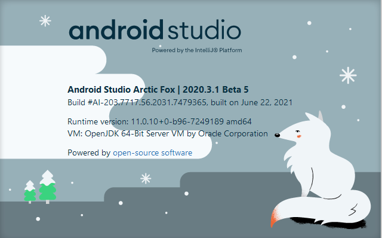

* Change appId constant in AndroidConfiguration.kt to your applicationId.

* Create a firebase android project with the applicationId you provided and download and add
  google-services.json to the project under app/src folder.

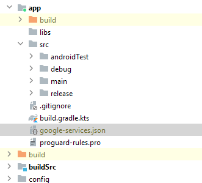

## Screens

### mobile

 

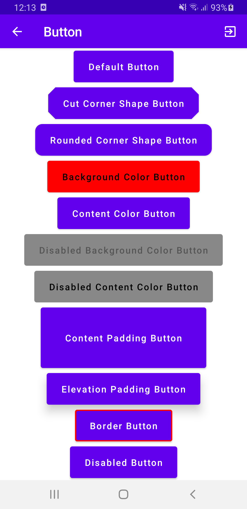 

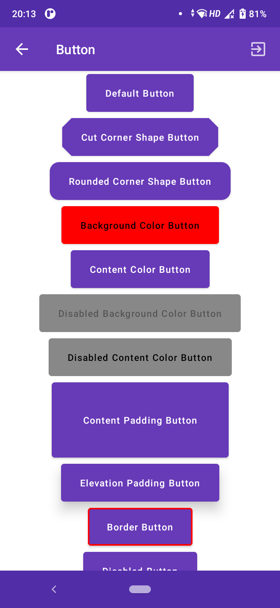 

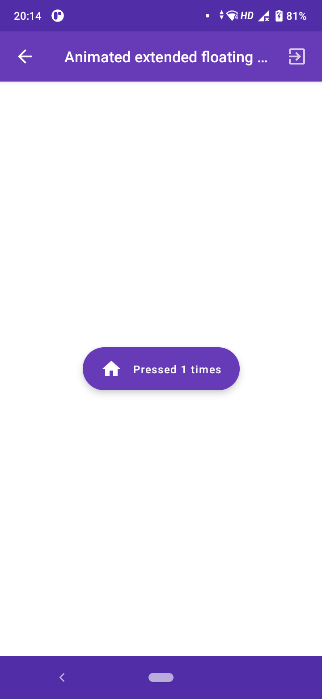 

### tablet 7-inch

 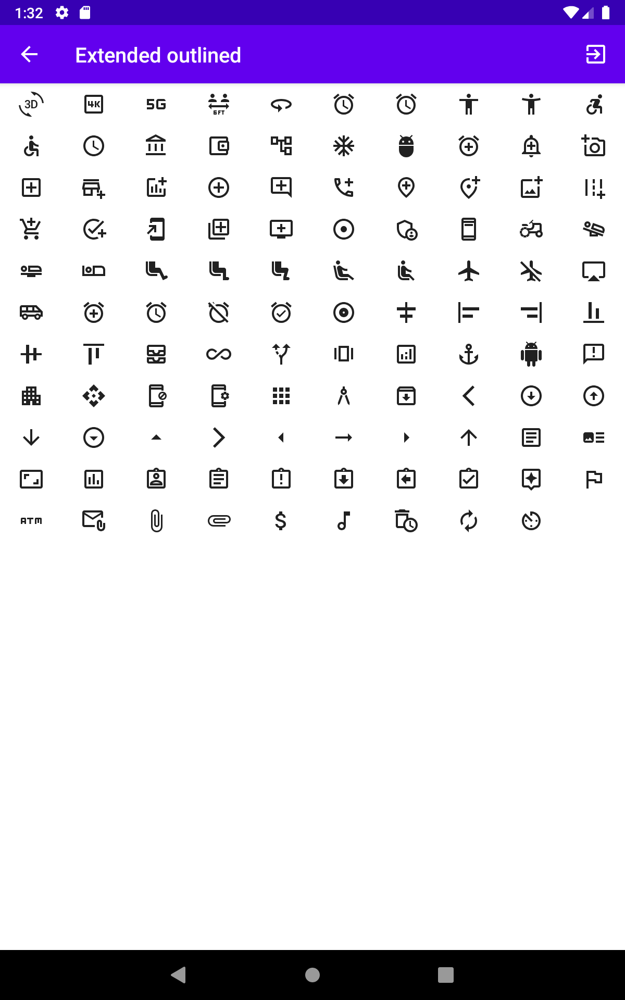

 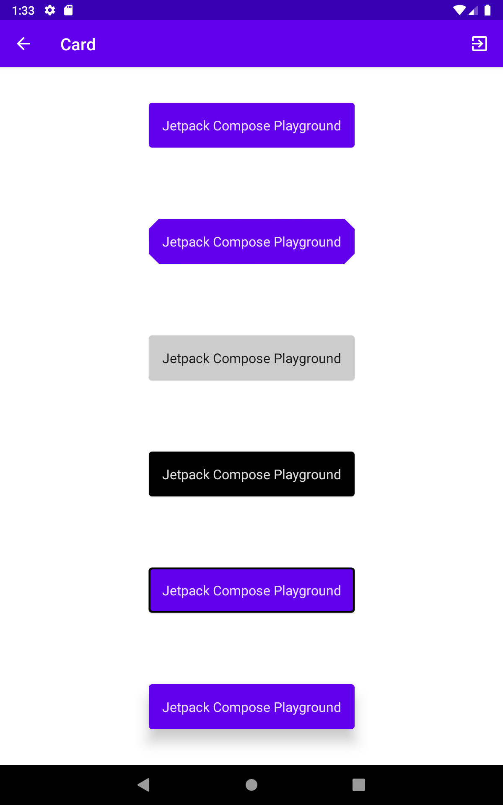

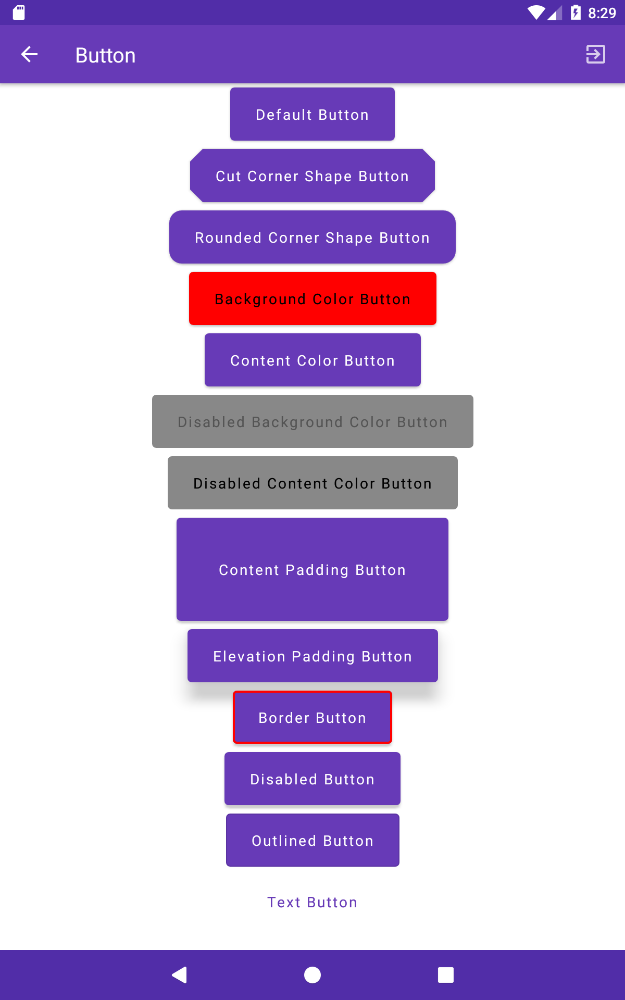 

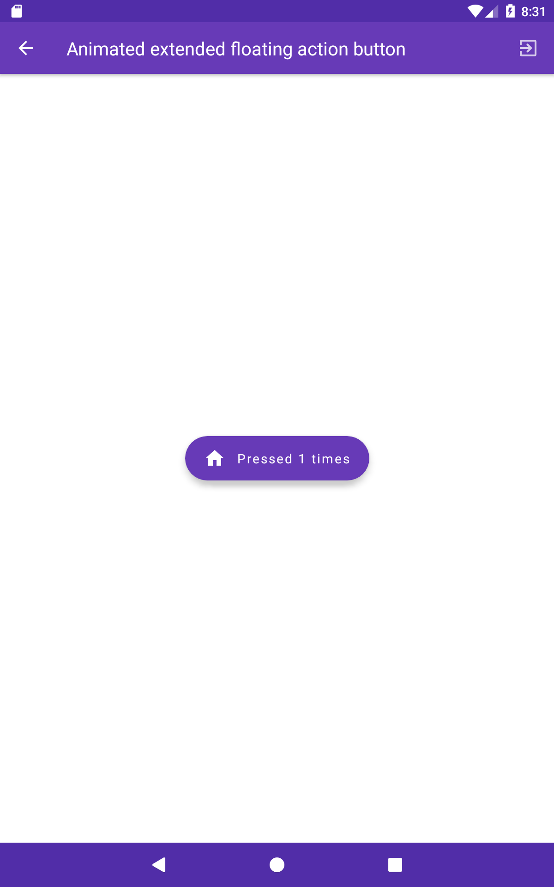 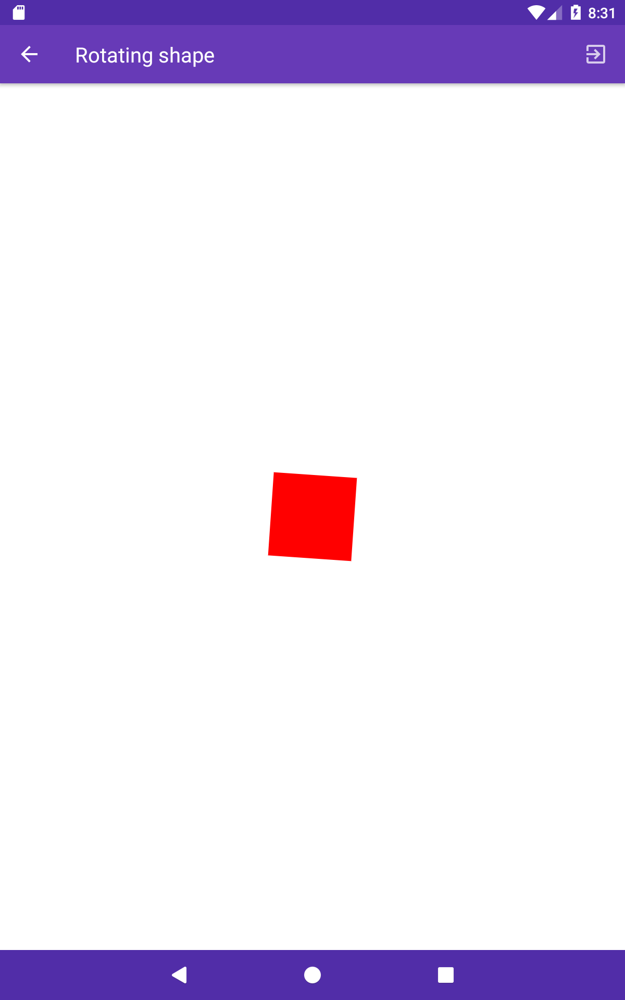

### tablet 10-inch

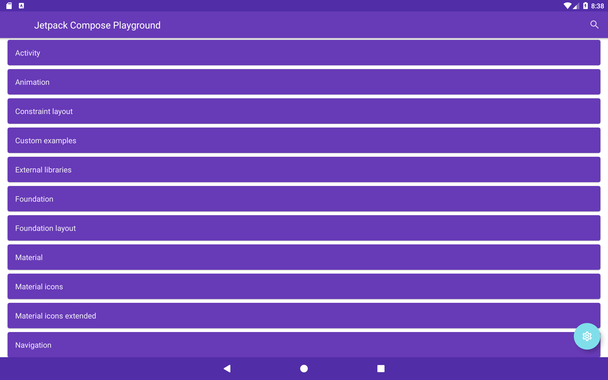 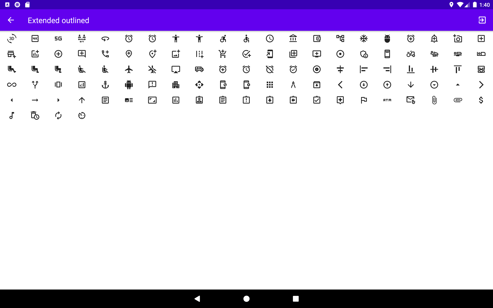

 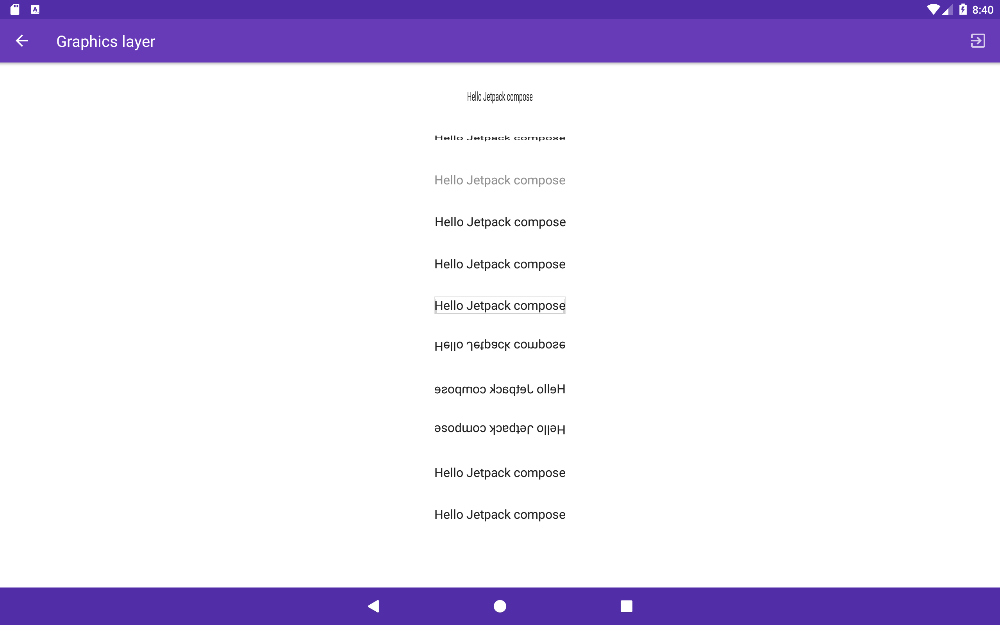

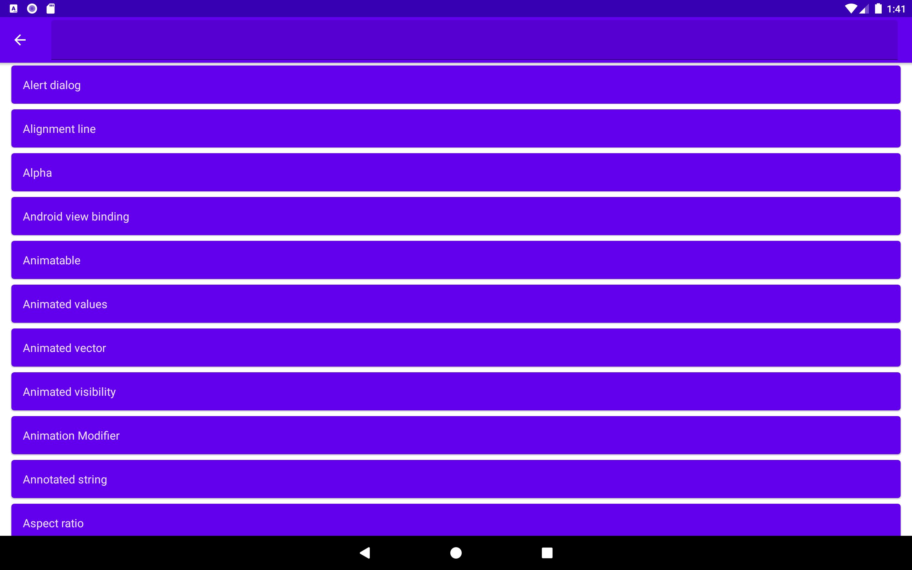 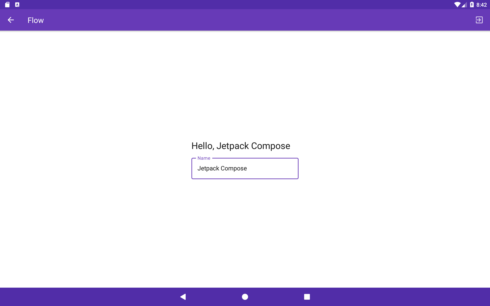

 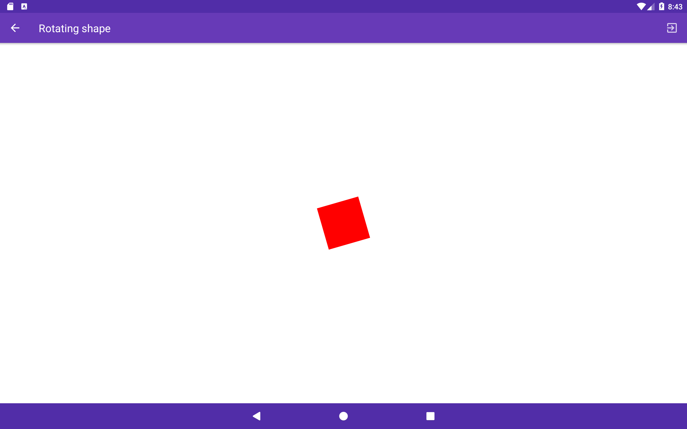